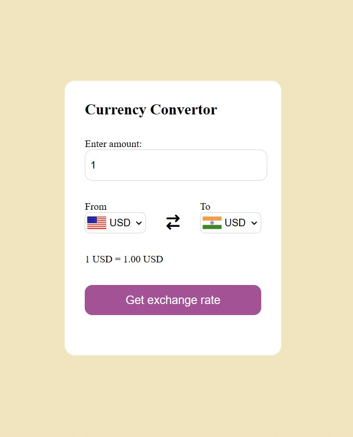

# 💱 Currency Converter (HTML, CSS, JavaScript)

A simple and responsive **Currency Converter Web App** that allows users to convert currencies in real-time using an external API.

---

## 🚀 Features

* 🔄 Convert between multiple currencies
* 🌍 Supports real-time exchange rates
* 🏳️ Country flags for better UI
* ⚡ Instant conversion on selection change
* ❌ Prevents invalid inputs
* 📱 Responsive design

---

## 🛠️ Tech Stack

* **HTML5**
* **CSS3**
* **JavaScript (Vanilla JS)**
* Currency API (fawazahmed0)

---

## 📸 Screenshots

> Add your screenshots here
> Example:
> 

---

## ⚙️ How to Run Locally

1. Clone the repository:

   ```bash
   git clone https://github.com/CarExpert-Subhajit/Currency-Convertor-using-HTML-CSS-and-JS.git
   ```

2. Open the project folder:

   ```bash
   cd Currency-Convertor-using-HTML-CSS-and-JS
   ```

3. Run the project:

   * Open `index.html` in your browser

---

## 🌐 API Used

* https://cdn.jsdelivr.net/npm/@fawazahmed0/currency-api

---

## ✨ Future Improvements

* 🔁 Add currency swap button
* 📊 Add historical data charts
* ⚛️ Convert to React / Next.js
* 🌙 Dark mode support

---

## 🤝 Contributing

Contributions are welcome! Feel free to fork this repo and submit a pull request.

---

## 📄 License

This project is open-source and available under the MIT License.

---

## 👨‍💻 Author

**Subhajit (CarExpert)**

* GitHub: https://github.com/CarExpert-Subhajit

---

⭐ If you like this project, give it a star!
